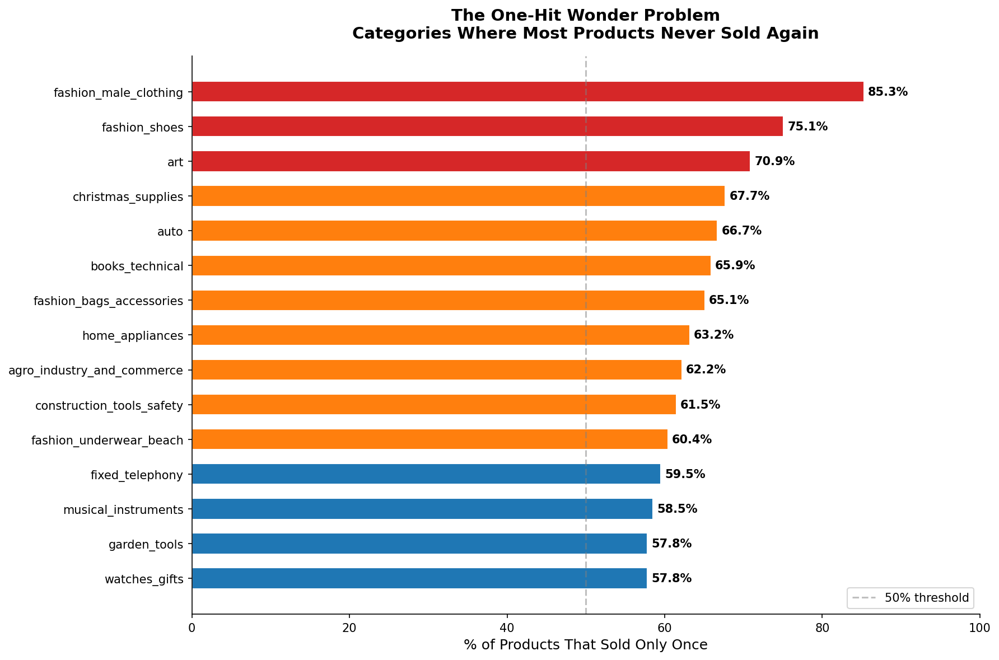
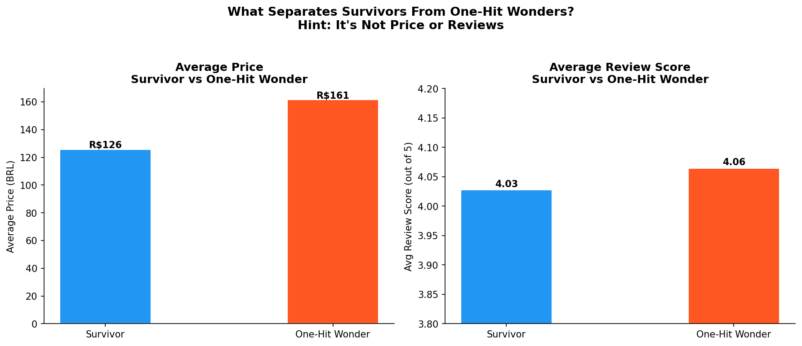
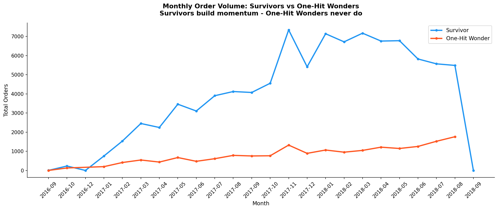

# The One-Hit Wonder Problem
### Why Most E-Commerce Products Sell Once and Disappear

---

## What This Project Is About

Every e-commerce team obsesses over the same things — reviews, ratings, visibility, trending products. The assumption baked into most catalog and inventory decisions is that a good product will find its audience over time.

This project challenges that assumption.

Using the Olist Brazilian E-Commerce dataset (100k+ real orders across 32k products), I found that **55% of all products on the platform sold exactly once and never again** — regardless of their price or review score. These aren't bad products. They're invisible ones.

The question isn't why they got bad reviews. Most of them got decent reviews. The question is why they never got a second chance.

---

## What Surprised Me

I went into this expecting boring, low-reviewed products to be the stable sellers — quiet workhorses that trickle sales consistently. The data proved that completely wrong. One-hit wonders actually had slightly better review scores and higher average prices than survivors. That was the moment the project changed direction entirely. The real story wasn't about product quality at all.

---

## The Core Finding

| Segment | Products | Avg Price | Avg Review Score |
|---|---|---|---|
| Survivor (sold 2+ times) | 14,939 | R$126 | 4.03 |
| One-Hit Wonder (sold once) | 18,012 | R$161 | 4.06 |

One-hit wonders are actually **more expensive** and have **nearly identical review scores** compared to survivors. Price doesn't save you. A good rating doesn't guarantee repeat demand.

What separates them is momentum — and most products never get enough of it to start.

---

## Key Insights

**1. The majority of the catalog is a graveyard**
Over 18,000 products (55%) sold exactly once across the entire dataset period. They exist in the catalog, occupy inventory space, and generate zero repeat revenue.

**2. Fashion and niche categories are worst affected**
Fashion male clothing leads with an 85.3% one-hit wonder rate. Fashion shoes (75.1%), art (70.9%), and auto parts (66.7%) follow. These are categories with high SKU variety and low repeat purchase behavior.

**3. Survivors build momentum — one-hit wonders never do**
Monthly order volume for survivor products grows consistently over the 2016–2018 period. One-hit wonder products flatline from day one. The gap between the two lines isn't a product quality gap — it's a visibility compounding gap.

**4. The long tail is not a passive revenue stream**
The long tail theory suggests that low-selling products collectively generate significant revenue. In this dataset, the long tail is mostly dead weight. Inventory managers banking on slow, steady trickle sales from niche SKUs are likely over-invested in products that will never sell again.

---

## Visuals

### One-Hit Wonder Rate by Category


### What Separates Survivors From One-Hit Wonders?


### The Flywheel Effect: Monthly Order Volume Over Time


---

## Dataset

**Source:** [Olist Brazilian E-Commerce Dataset](https://www.kaggle.com/datasets/olistbr/brazilian-ecommerce) via Kaggle

**Files used:**
- `olist_orders_dataset.csv`
- `olist_order_items_dataset.csv`
- `olist_order_reviews_dataset.csv`
- `olist_products_dataset.csv`
- `olist_product_category_name_translation.csv`

**Scale:** 99,441 orders, 112,650 order line items, 32,951 unique products across 2016–2018

---

## Tech Stack

Python, Jupyter Notebook, pandas, matplotlib, seaborn

---

## How to Run

```bash
git clone https://github.com/jith2002/one-hit-wonder-ecommerce
cd one-hit-wonder-ecommerce
pip install pandas numpy matplotlib seaborn
jupyter notebook analysis.ipynb
```

Download the Olist dataset from [Kaggle](https://www.kaggle.com/datasets/olistbr/brazilian-ecommerce) and place the CSV files in the same directory as the notebook before running.

---

## Limitations

- Dataset covers a single Brazilian marketplace (Olist) from 2016–2018. Findings may not generalize to other geographies or platforms.
- Products with one review have a score standard deviation of 0 by definition, not because of genuine rating consistency. This was noted and accounted for in segmentation.
- "Survivor" vs "one-hit wonder" is defined purely on order count, not profitability. A product that sold once at a high margin could still be a business success.

---

## About

Built by Ranjith Kumar T M — Data Analyst with experience in fraud/risk operations (Fi Money) and supply chain analytics (Target Corporation India).

[LinkedIn](https://linkedin.com/in/ranjith-kumar-t-m) | [GitHub](https://github.com/jith2002)
